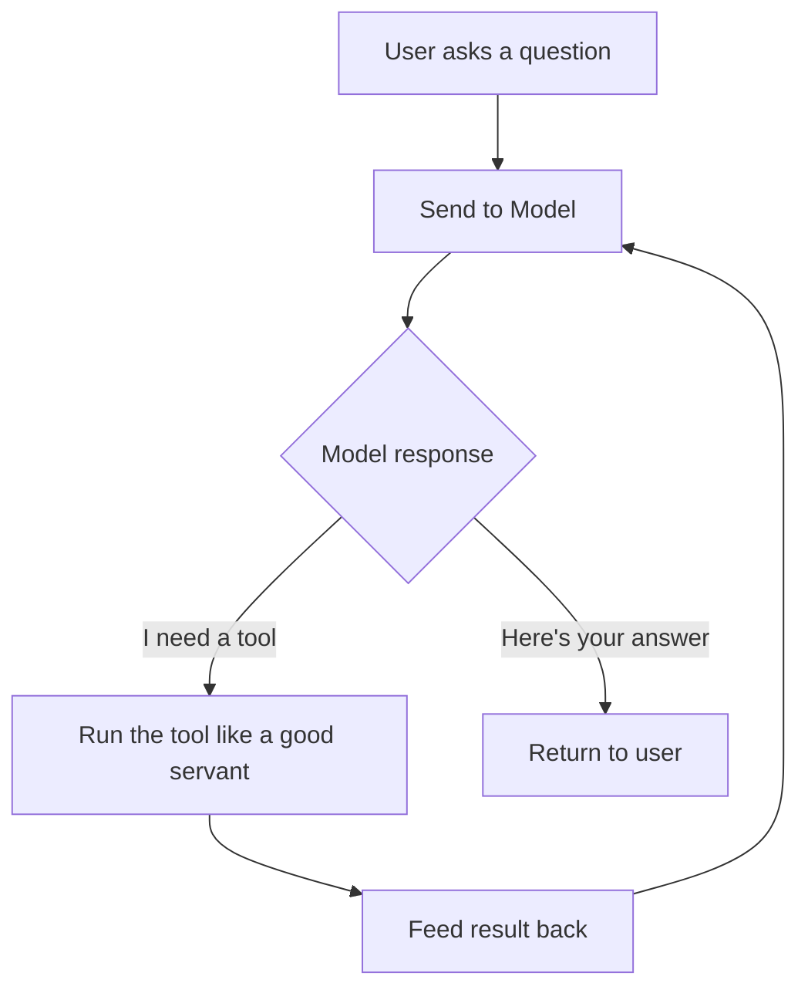
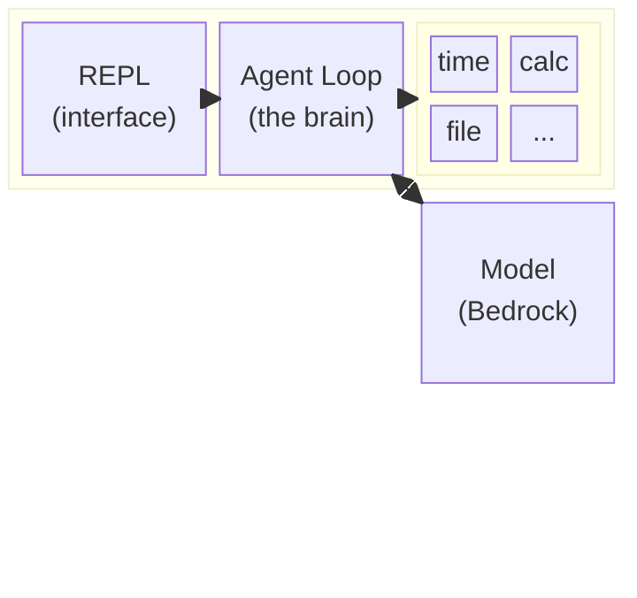
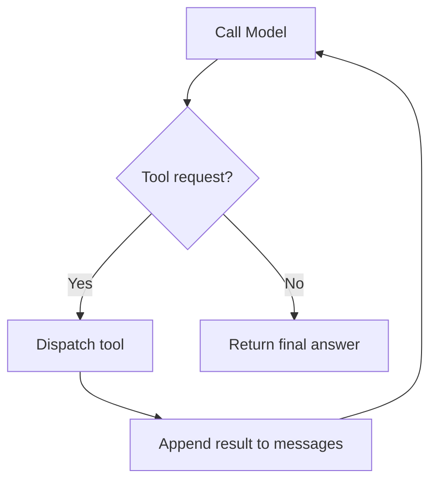
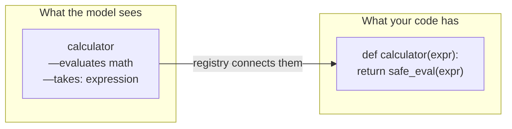
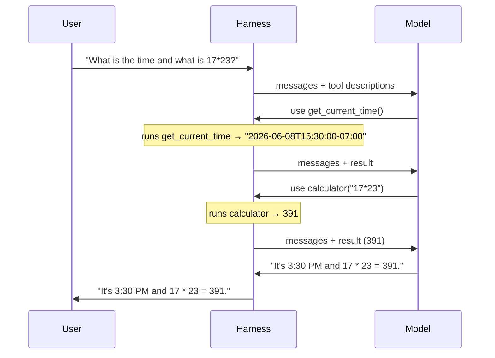

You've seen the demos. AI agents booking flights, writing code, querying databases, probably filing your taxes while whispering sycophantic flattery. Very impressive. Very "the future is here."

Here's the simple secret nobody mentions in the keynote:

**LLMs can only produce text.**

That's it. They can't run code. They can't check the time. They can't read a file. They are the world's most confident interns — full of opinions, zero ability to actually do anything. All they do is predict the next token and hope you're impressed.

So how do agents *do things*? Someone has to be the adult in the room. That someone is the **agent harness**.

## Get the Code (Yes, It Works)

This whole series is backed by a working agent. Not a "works on my machine" kind of working — a "here's 600 lines of Python, go run it yourself" kind of working.

```bash
git clone https://github.com/kenkitts/bedrock-agent-harness.git
cd bedrock-agent-harness
python3 -m venv .venv
source .venv/bin/activate
pip install -r requirements.txt
python agent.py
```

You'll need an AWS account with Bedrock access in `us-east-1`. The README holds your hand through setup. Clone it now. Read the code while you read these posts. Or don't — I'm a blog post, I won't know.

## The Big Idea

An agent harness is the babysitter code that wraps around a language model and translates its *wishes* into *actions*. The model says "I'd like to run the calculator with `17 * 23`" and your code sighs, does the actual math, hands the result back, and asks "anything else, master?"

It's a loop. The most important `while True` you'll ever write.



That's the whole concept. The model thinks. Your code does. Like every group project you've ever been in, except this time the person doing nothing is a billion-parameter neural network.

## The Basic Components

Every agent harness — from weekend toy to production nightmare — has some version of these pieces:



Let's walk through each one.

### 1. The Interface (REPL)

This is how you talk to the agent:

```text
> What is 17 * 23 + 4?
```

That's it. A prompt. You type, it listens. It handles the human side — reading input, displaying output, and providing commands like `/reset` when the conversation goes off the rails (and it will).

Think of it as the hostage negotiator between you and an entity that genuinely believes it can browse the internet despite being a function that multiplies matrices.

### 2. The Agent Loop

The heart of the harness. This is the `while` loop that earns its keep:

1. Send the conversation to the model
2. Check what came back
3. If the model wants to use a tool → run it, feed the result back, go to step 1
4. If the model is done → return the answer



The key insight: **the model doesn't run tools**. It *requests* them. It's like a toddler pointing at things in the grocery store. Your harness is the exhausted parent actually putting items in the cart.

This also means you need a **circuit breaker** — a maximum number of iterations. Because if you don't cap the loop, a confused model will happily call tools until heat death (or until you freak out upon seeing the bill and pull the plug). My harness caps at 25 rounds. Sleep well.

### 3. The Tool Registry

Tools are the agent's hands. Without them, it's just a chatbot with delusions of grandeur.

A tool needs two things:
- A **description** (so the model knows when to use it — like a menu)
- An **implementation** (the actual code — like the kitchen)

The registry connects them. When the model says "run calculator with `17 * 23`", the registry looks up "calculator" and calls the right function. It's a phonebook for capabilities.



The beauty of a registry: adding a new tool is just adding one more entry. The loop doesn't care. It dispatches whatever you register. This is great for extensibility and also great for accidentally giving an LLM access to your filesystem. We'll talk about sandboxing later.

### 4. The Model Client

Your phone line to the LLM. In my project, it's Amazon Bedrock's Converse API. You send messages, you get responses back, and those responses might contain tool-use requests (or existential poetry about being a language model — depends on the temperature setting).

The model client handles:
- Authentication (AWS credentials — the "please prove you're allowed to spend money" step)
- The actual API call
- Retries for transient failures (because the cloud is just someone else's computer having a bad day)

### 5. Session State

The agent needs to remember what happened earlier in the conversation. Without session state, every model call is a fresh start — a goldfish with a PhD.

At minimum, session state is the message history: the running transcript of user messages, assistant responses, and tool results. This is how the model knows which tools already ran and what they returned.

In my harness, it's an in-memory list. When you type `/reset`, it's gone. Like tears in rain, etc.

## How They Work Together

Let's trace through a real example. The user asks "What is the time and what is 17 * 23?" and watch what happens:



Notice what happened:
- The model decided *on its own* to call two different tools. Nobody told it which ones or in what order.
- The harness just did what it was told — run the tool, feed the result back. No opinions. No strategy.
- The harness didn't even know what the user was asking for. The model figured that out.

**The model reasons. The harness acts.** One is the scheming supervillain. The other is the henchman who actually builds the death ray. You're building the henchman that builds the death ray, so your hands are clean.

## Why Build One from Scratch?

You could use LangChain. You could use CrewAI. You could use seventeen layers of abstraction stacked in a trench coat pretending to be a framework. They're fine. Probably.

But building a harness from scratch teaches you:

- **What's actually happening** under the hood (spoiler: it's embarrassingly simple)
- **Where the security boundaries need to be** (the model decides what tools run — let that sink in)
- **How to debug when things go wrong** (and they will, gloriously)
- **That the magic isn't magic** — it's just a `while` loop, a `dict`, and someone else's GPU

Once you see the loop, you can't unsee it. Every agent framework is just a decorated version of what we're building here.

## What's Next

In the next post, we'll look at actual code — how the tool registry works with a decorator pattern that keeps schema and implementation in sync. We'll also dig into why `eval()` is a war crime and how to build a safe calculator that won't let the model `rm -rf` your life.

---

*This is Part 1 of a series on building an AI agent harness from scratch using Python and Amazon Bedrock. [Grab the code](https://github.com/kenkitts/bedrock-agent-harness) and follow along — or just read and judge from the sidelines. I respect both approaches.*
