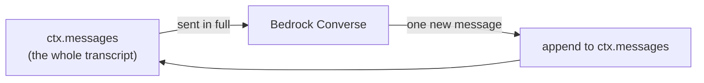
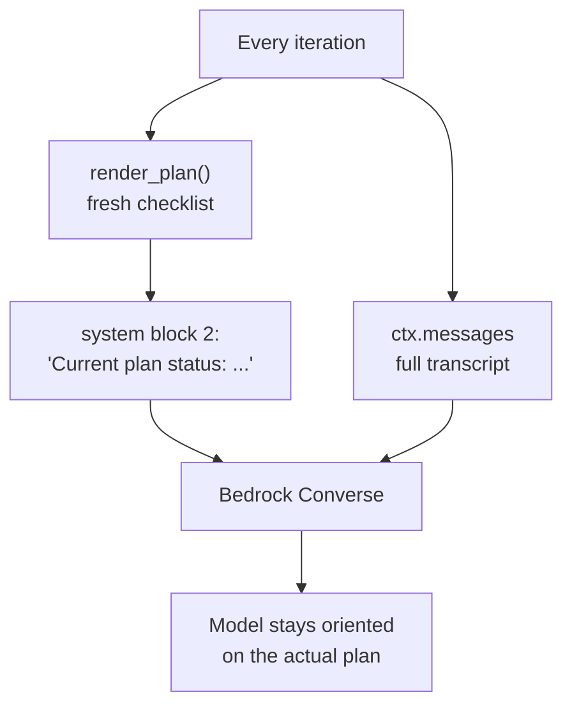
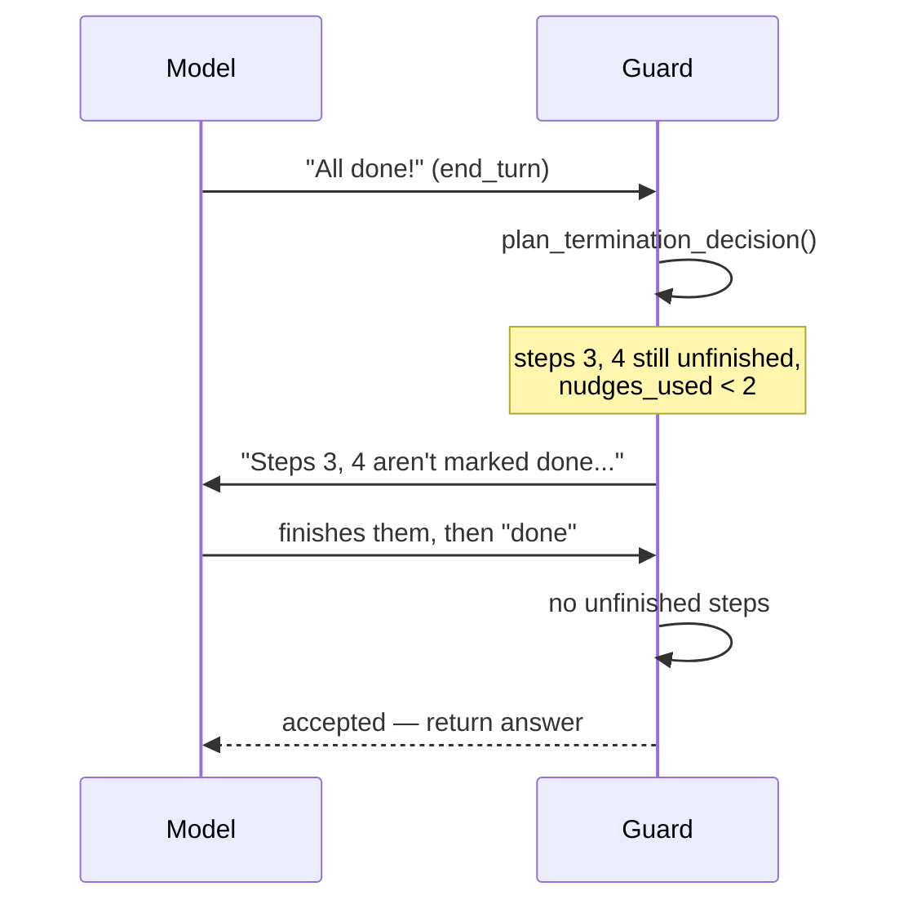

In [Part 1](/posts/agent-harness-part-1/) we built the loop. In [Part 2](/posts/agent-harness-part-2/) we handed the model some knives — tools, sandboxed so it couldn't read your SSH keys. Both parts leaned on a thing I kept gesturing at and refusing to explain: the `Session` object. The agent's memory.

Time to explain it. Here's the uncomfortable foundation everything in this post sits on:

**The model remembers nothing.** Each call to Bedrock is a blank slate. The model that answered your last question has no idea it ever existed. It is a brilliant amnesiac, waking up fresh every single time, and the only reason it appears to "remember" the conversation is that *you* shove the entire transcript back in front of it on every request. Memory isn't a model feature. It's a thing your harness does, by hand, at a cost. And the bill — we'll get to the bill.

All the code below is real, lifted from [the repo](https://github.com/kenkitts/bedrock-agent-harness). One `agent.py`, clone it and follow along.

## The Goldfish With a PhD

The Converse API is stateless. You send a list of messages, you get one message back. There is no server-side session, no thread, no "conversation" Bedrock is tracking for you. If you send one message, the model sees one message. If you want it to know what happened thirty seconds ago, you send all of that too.

So "conversation history" is just a list you keep on your side of the wire and resend in full, every turn:



That list — plus a couple of other things that have to survive between calls — is the entire concept of session state. In this harness it lives in one small object.

## The Session Object

Two classes, no cleverness. A `Task` is one step in a plan. A `Session` is everything that lives for the duration of one REPL run:

```python
class Task:
    """One step in the plan."""
    def __init__(self, task_id, description):
        self.id = task_id
        self.description = description
        self.status = "pending"        # pending -> in_progress -> done


class Session:
    """Holds everything that lives for one REPL session: the conversation
    transcript and the current plan."""
    def __init__(self):
        self.messages = []            # the conversation transcript
        self.plan = []                # list[Task]
        self.writes_approved = False  # confirm-once gate for file writes

    def render_plan(self):
        """Human/model-readable checklist, e.g. '[x] 1. Calculate 12*8'."""
        if not self.plan:
            return "(no plan yet)"
        mark = {"pending": "[ ]", "in_progress": "[~]", "done": "[x]"}
        return "\n".join(f"{mark[t.status]} {t.id}. {t.description}" for t in self.plan)
```

Three fields. `messages` is the transcript. `plan` is the checklist. `writes_approved` is that confirm-once gate from Part 2 — the reason `write_file` needed to be stateful. All of it gets created once per run and threaded through the loop. No module-level globals, no singletons pretending they aren't globals. When you type `/reset`, two lines wipe `messages` and `plan` and the agent is reborn with no past. Like tears in rain, etc.

Notice the model never holds any of this. The harness does. The model is a function; the `Session` is the notebook the function keeps getting handed.

## Why You Re-Inject the Plan Every Single Time

Here's the part people get wrong. You'd think you create a plan once, the model reads it once, and off it goes. But remember — the model is an amnesiac. By the time it's three tool calls deep, the `create_plan` result is buried somewhere up in the message history, competing for attention with tool outputs and its own chatter. Models drift. They forget step 4 existed. They declare victory at step 2.

So the plan doesn't live *only* in the transcript. On every request, the current checklist is rendered fresh and bolted on as a **second system block**, right next to the standing instructions:

```python
# Base system prompt, plus the live plan when one exists (anti-drift).
system_blocks = [{"text": SYSTEM_PROMPT}]
if ctx.plan:
    system_blocks.append({"text": "Current plan status:\n" + ctx.render_plan()})
```

The plan is always in the model's face, always current, always reflecting the latest `[x]` and `[~]` marks. It can't drift away because it's not relying on the model to remember it — the harness re-states it, top of mind, every round. 



This is the whole trick to keeping a multi-step agent on the rails: **don't trust the model to remember the plan — remind it, constantly.** It's nagging, basically. We built a structured way to nag a neural network. 

## The Plan Tools, Briefly

Three stateful tools drive the checklist, all receiving the `Session` as `ctx` (the mechanism from Part 2): `create_plan` lays out the steps, `update_task` flips a step's status, `view_plan` dumps the current state when the model loses the thread. The interesting one is `update_task`, and the interesting thing about it is how it fails:

```python
def update_task(ctx, task_id, status):
    task_id = int(task_id)                 # be forgiving if it arrives as a string
    for t in ctx.plan:
        if t.id == task_id:
            t.status = status
            return f"Step {task_id} -> {status}\n" + ctx.render_plan()
    raise ValueError(f"No such task id: {task_id}")   # recoverable: returned to model
```

The model invents a step 7 that doesn't exist? `raise`, the error becomes a `toolResult` (Part 2's iron law: *a tool failure is just more text for the model to read*), and the model corrects itself. Every status update returns the freshly rendered plan, too — so even the tool result reinforces the current state. We are nothing if not consistent about the nagging.

## The Soft Termination Guard

Now the good part. The model will, with total confidence, announce it's finished while half the plan sits unchecked. It's an intern declaring the project done because it closed two of the five tickets and got bored. You cannot let "I'm done" be self-certified.

So when the model tries to end its turn, the harness checks the plan first. This decision is pulled out into a pure, boring, testable function — the kind of function that has no opinions and never surprises you:

```python
def plan_termination_decision(plan, nudges_used, max_nudges):
    """Decide whether to accept the model's end-of-turn or nudge it to finish.

    Returns (action, reminder_text):
      - ("accept", None)  -> no unfinished steps, OR the nudge budget is spent
      - ("nudge",  text)  -> there are unfinished steps and nudges remain
    """
    unfinished = [t for t in plan if t.status != "done"]
    if not unfinished or nudges_used >= max_nudges:
        return ("accept", None)
    ids = ", ".join(str(t.id) for t in unfinished)
    reminder = (
        f"You indicated you are finished, but these plan steps are not yet marked "
        f"done: {ids}. Either complete them and mark them done, or — if the task is "
        f"genuinely complete — briefly explain why and finish."
    )
    return ("nudge", reminder)
```

And the loop wires it in at the moment the model says it's done:

```python
# ---- Branch B: no tool requested -> candidate final answer ----
if ctx.plan:
    action, reminder = plan_termination_decision(ctx.plan, nudges_used, MAX_NUDGES)
    if action == "nudge":
        nudges_used += 1
        ctx.messages.append({"role": "user", "content": [{"text": reminder}]})
        continue  # give the model another round to finish
```

It's a *soft* guard for two deliberate reasons.

First, it nudges — it doesn't force. The reminder explicitly offers the model an out: *if the task is genuinely complete, explain why and finish.* Sometimes a step turns out to be unnecessary, and a model that can articulate "step 3 was redundant because step 2 already covered it" is more useful than one frog-marched through busywork to satisfy a checklist.

Second, the nudging is **capped** — `MAX_NUDGES = 2`. Once the budget is spent, `plan_termination_decision` returns `("accept", None)` and the harness takes the answer, finished or not. Because the failure mode you're guarding against — a model that won't stop — is the same shape as the thing you're building. Nag it forever to finish and you've just built a different infinite loop with a more self-righteous tone.



Between this and the hard `MAX_ITERATIONS = 25` cap from Part 1, the agent has two independent brakes: one that stops it quitting too early, one that stops it running forever. Optimism and pessimism, both in code.

## The Bill Arrives

Here's the thing nobody puts on the slide deck. Re-injecting the whole transcript every turn works beautifully and costs you accordingly.

Bedrock bills per token — input and output, priced separately. And the harness tells you exactly how many tokens each round burned, because the Converse response hands back a `usage` block:

```python
log.info("Model responded: stopReason=%s | tokens in=%s out=%s total=%s | latency=%sms",
         stop_reason, usage.get("inputTokens"), usage.get("outputTokens"),
         usage.get("totalTokens"), metrics.get("latencyMs"))
```

Watch `inputTokens` over a long conversation and your stomach drops. Because the input is the *entire history*, every turn re-sends everything that came before:

- Turn 1: send the system prompt + one message. Cheap.
- Turn 8, mid-tool-spree: send the system prompt, the plan, eight rounds of model chatter, and every tool result those rounds produced. Not cheap.

Each turn's input is roughly *all previous turns combined*. A conversation's total token cost doesn't grow linearly with length — it grows like the sum of a staircase, closer to quadratic. A chatbot with a perfect memory and no sense of thrift will, over a long enough session, spend most of its budget re-reading its own back catalogue. You are paying, repeatedly, to remind the model of things it said and then immediately forgot.

This is why the v1 harness keeps the whole transcript in memory and *doesn't* trim it — simple and correct, but it has a meter running. Real systems eventually need history windowing (drop or summarize old turns), and Claude's context window is large but finite, so "just keep everything forever" eventually hits a wall as well as a bill.

One small mercy worth noting: when a turn blows up mid-flight, the harness doesn't leave a half-written conversation to rot and confuse the next request. It checkpoints and rolls back:

```python
checkpoint = len(ctx.messages)              # roll-back point if the turn fails
ctx.messages.append({"role": "user", "content": [{"text": user_input}]})
try:
    answer = run_agent_turn(client, ctx)
except Exception as e:
    del ctx.messages[checkpoint:]           # un-append the failed turn
    log.error("Unexpected error: %s", e)
```

A failed turn vanishes from history entirely. Memory you can't trust is worse than no memory — so a turn that errored out doesn't get to poison everything after it.

## What We've Got

The `Session` object that everything else has been quietly leaning on. A plan that gets re-injected every request so the model can't drift off it. A soft guard that won't accept a fake "done" — but won't nag to the heat death of the universe either. And a clear-eyed look at the bill memory runs up, because pretending agents are cheap is how you end up explaining a Bedrock invoice to someone who signs the checks.

One rule underneath all of it, the mirror of Part 1's: **the model reasons, but it doesn't remember. The harness remembers — and pays the toll for doing so.**

## What's Next

In [Part 4](/posts/agent-harness-part-4/) we go off-box: **remote tools over MCP.** That `/connect` command lurking in the REPL wires a whole separate tool server into the same registry the local tools use — the model can't tell the difference, which is the entire point, and also exactly the kind of thing that should make a security-minded person nervous. We'll see why one registry to rule them all is elegant, and what it means to trust a knife you didn't forge yourself.

---

*This is Part 3 of a series on building an AI agent harness from scratch using Python and Amazon Bedrock. [Grab the code](https://github.com/kenkitts/bedrock-agent-harness) and run it — then open the session log and watch the input-token count climb. That's memory, billed by the byte.*
