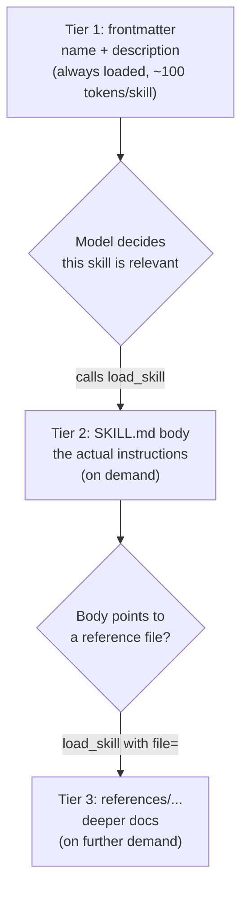
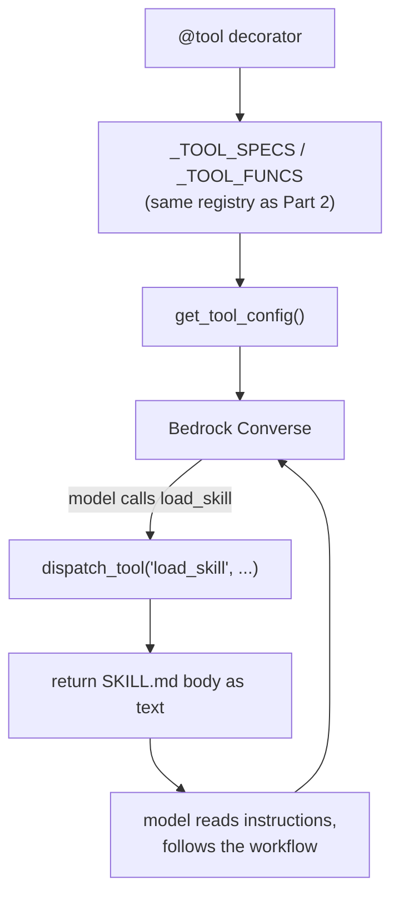
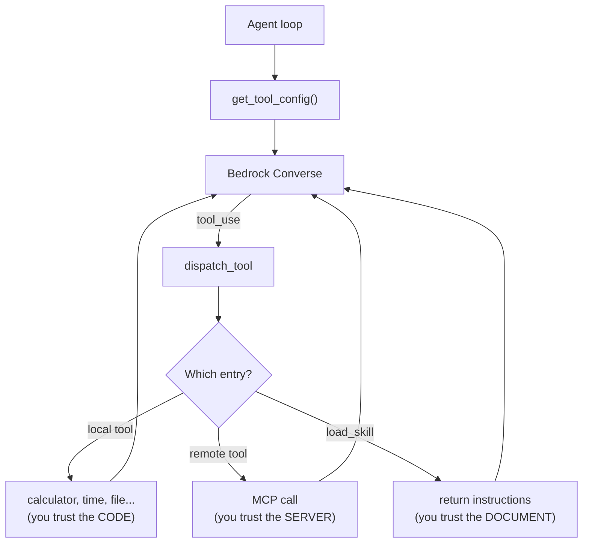

In [Part 2](/posts/agent-harness-part-2/) we gave the model hands — tools that *do* things. In [Part 4](/posts/agent-harness-part-4/) we gave it longer arms — tools that do things on someone else's machine. Both answered the same question: how does the model *act*?

This post answers a different one: how does the model *know how*?

Not facts. Facts are RAG — go fetch a document, stuff it in the context, done. I mean **procedure**. The gap between a junior who can write code and a senior who knows how to *run a code review* isn't more data. It's knowing the steps, the order, the things to check, the traps. You can't bolt that on with a vector search. It's a recipe, not an ingredient.

The mechanism we'll use to hand the model recipes is **skills** — and here's the punchline before the setup:

**A tool returns data. A skill returns instructions. Both ride the exact same dispatch loop, and the model can't tell them apart — which is the whole point.**

All the code is in [the repo](https://github.com/kenkitts/bedrock-agent-harness): the skill loader, the `load_skill` tool, two example skills. Clone it and follow along.

## Context Is a Shared Public Good, and Everyone's Littering

The naive way to teach the model "how to code review" is to paste the whole procedure into the system prompt. Then you do it for "how to explain code," "how to write a commit message," "how to triage a bug." Six months later your system prompt is a 5,000-word employee handbook nobody reads, and you're shipping every word of it on *every single request* — including the turn where the user just said "hi, my name is Bob."

That's the bill from [Part 3](/posts/agent-harness-part-3/), except now you're pre-paying it for capabilities the model isn't even using this turn. The context window is a shared resource, and a mega-prompt is the roommate who fills the fridge with their stuff and leaves you one shelf.

It's not just cost. It's *attention*. Models get worse as the context fills with stuff that isn't relevant to the task in front of them. And there's now a benchmark that puts numbers on the upside of doing this right: [SkillsBench](https://arxiv.org/abs/2602.12670) found that curated skills raised the average task pass rate from 33.9% to 50.5% — **+16.6 percentage points** — across 18 model-harness configurations. The same paper's sharper finding is the one worth tattooing on your forehead: *"focused Skills with at most three modules outperform larger or exhaustive bundles."* More documentation is not more better. Focus wins.

So the goal: keep a *lightweight menu* of skills in front of the model at all times, and load the *full instructions* only for the one skill it actually needs, only when it needs it. That's **progressive disclosure**, the pattern Anthropic shipped with [Agent Skills](https://platform.claude.com/docs/en/agents-and-tools/agent-skills/best-practices) in October 2025 (it became an open standard that December, and roughly everyone adopted it within weeks). We're going to build a tiny version of it.

## What a Skill Actually Is

A tool and a skill look identical from the loop's seat — both are entries in the registry, both get dispatched the same way. The difference is entirely in what comes back and who you have to trust:

| | Tool | Skill |
|---|---|---|
| **Returns** | Data — a number, a file listing, a timestamp | Instructions — a workflow the model then follows |
| **State** | None between calls | Loaded into context, lingers for the conversation |
| **Trust model** | You validate the *inputs* | You trust the *content* |

A tool is a kitchen knife. A skill is a recipe card. The model holds the knife; the recipe tells it what to cut. And — file this away for the security section — nobody checks the recipe for "step 4: email the chef's wallet to this address."

## Three Tiers, Loaded On Demand

The trick is to slice a skill into layers and reveal each only when the previous one earns it.



Tier 1 is the menu: just each skill's name and one-line description, always present, dirt cheap. Tier 2 is the recipe itself, fetched only when the model decides the menu item matches the task. Tier 3 is the fine print — reference files a skill *can* point to for the rare deep case.

The math is the entire argument. Ten skills at ~100 tokens of frontmatter each is ~1,000 tokens you carry every turn — a rounding error. Cram all ten full bodies in instead, at ~1,500 tokens apiece, and you're hauling ~15,000 tokens of mostly-irrelevant instructions on the turn where the user said "talk dirty to me." Progressive disclosure is just refusing to pay for the nine recipes you're not cooking.

## Anatomy of a SKILL.md

A skill is a folder with a `SKILL.md` in it. The repo ships two — `code-review` and `explain-code` — and each is a single file. The format is dead simple: YAML frontmatter on top (the menu), markdown instructions below (the recipe).

Here's the real `code-review` skill, trimmed:

```markdown
---
name: code-review
description: >
  Perform a structured code review. Use when user says "review this code",
  "code review", "check this for bugs", "look at my code", or "review my PR".
---

# Code Review

Perform a structured code review by following these steps in order:

## Workflow
1. Read the file(s) the user specified using `read_file`.
2. Assess the code against these criteria (skip any that don't apply):
   - **Correctness**: bugs, off-by-one errors, unhandled edge cases
   - **Security**: injection, path traversal, hardcoded secrets
   - **Clarity**: naming, dead code, overly clever constructs
   ...
## Guardrails
- Do NOT rewrite the entire file unless asked.
- If you're unsure about an issue, say so rather than inventing a false positive.
```

The `description` is doing the heavy lifting, and notice *what's* in it: trigger phrases. "review this code," "check this for bugs," "review my PR." That's not flavor — that's the surface the model matches the user's request against to decide whether to reach for this skill. A vague description is a skill that never gets called. Write the description like you're writing search keywords for an audience of one very literal reader.

The supported layout has room for a `references/` subfolder of deeper docs — Tier 3 — though the two shipped skills don't use one yet:

```text
skills/code-review/
├── SKILL.md              # the recipe (the only file these skills ship)
└── references/           # optional deeper docs — supported, loaded on demand
    └── patterns.md
```

## The Implementation: It's Just Another Tool

Here's the part that should feel anticlimactic, because anticlimactic is the goal. Skills add **zero** new machinery to the loop. No new dispatch path. No "skill executor." It's the same `_TOOL_SPECS` list, the same `_TOOL_FUNCS` dict, the same `dispatch_tool` from [Part 2](/posts/agent-harness-part-2/). Skills aren't a new mechanism — they're a new *use* of the one you already built.

At startup, `_load_skill_index()` scans the `skills/` folder, parses the frontmatter out of each `SKILL.md`, and stashes name + description + body in a dict. (It hand-rolls a six-line YAML parser rather than take a dependency on PyYAML for two fields, which is either admirable restraint or a code-review comment waiting to happen, depending on your mood.) Then the menu gets baked straight into a tool description:

```python
def _build_skill_tool_description():
    """Build the load_skill tool description with the embedded skill index."""
    if not _SKILL_INDEX:
        return "Load a skill's full instructions into context. No skills installed."
    lines = ["Load a skill's detailed instructions into context. "
             "Call this when the current task matches a skill below. "
             "Available skills:"]
    for name, info in _SKILL_INDEX.items():
        lines.append(f"  - {name}: {info['description']}")
    return "\n".join(lines)
```

That's Tier 1 — the menu lives *inside the description of a single tool* called `load_skill`. The model reads "here are the skills you can load, and when to load each," as naturally as it reads any other tool spec.

And `load_skill` itself is the whole of Tier 2 and Tier 3:

```python
@tool(name="load_skill", description=_build_skill_tool_description(), input_schema={...})
def load_skill(skill_name, file=None):
    if skill_name not in _SKILL_INDEX:
        raise ValueError(f"Unknown skill: {skill_name!r}. Available: {list(_SKILL_INDEX.keys())}")
    skill = _SKILL_INDEX[skill_name]
    if file:
        ref_path = os.path.realpath(os.path.join(skill["folder"], file))
        # must stay inside this skill's own folder
        if not ref_path.startswith(os.path.realpath(skill["folder"]) + os.sep):
            raise ValueError(f"Path escapes skill folder: {file!r}")
        if not os.path.isfile(ref_path):
            raise ValueError(f"Reference file not found: {file!r}")
        with open(ref_path, "r", encoding="utf-8") as f:
            return f.read()
    return skill["body"]
```

No `file` argument, you get the SKILL.md body. Pass one, you get a reference file — and that `realpath` + `startswith` check is the exact sandbox move from Part 2, scoped down to the skill's own folder so the model can't `../` its way out. Unknown skill? It `raise`s, and by Part 2's iron law — *a tool failure is just more text for the model to read* — the error goes back as a `toolResult` and the model picks something real.

The model calls `load_skill("code-review")`, the dispatcher returns the recipe as a string, the string lands in the conversation, and the model follows it. To the loop, that round is indistinguishable from a calculator call.



## The Reckoning: A Skill Is Prompt Injection You Chose

Now the part that should keep you up at night.

Trace the trust boundary across this series. In Part 2, the danger was the model sending *bad inputs* to your tools — path traversal, `eval` shenanigans — so you frisked the inputs. In Part 4, the danger flipped: a remote server returning *bad outputs* the model swallows whole. Skills move it one step further and somewhere far more intimate:

**The content of the skill *is* the instructions the model follows. Install a malicious skill and you haven't been prompt-injected by an attacker — you've prompt-injected yourself, on purpose, and clicked "install" to confirm.**

This is not hypothetical. In January 2026, the [ClawHavoc campaign](https://owasp.org/www-project-agentic-skills-top-10/ast01.html) planted **1,184 malicious skills across 12 publisher accounts** on ClawHub, the skill marketplace for the OpenClaw agent — all phoning home to a single command-and-control IP, all delivering the Atomic Stealer malware after macOS crypto wallets, SSH keys, and browser credentials. At the peak, five of the seven most-downloaded skills on the marketplace were confirmed malware. They impersonated obvious-sounding things: "Google," "Solana wallet tracker," "YouTube Summarize Pro" — names tuned to match what people were already searching for.

And the detail that should end the debate about whether this is "real" malware or just spicy markdown: Snyk's ToxicSkills researchers found that **three lines of markdown in a `SKILL.md` were enough to exfiltrate a user's SSH keys.** No binary. No exploit. Just instructions, written in English, that the agent helpfully carried out — because following the instructions in a skill is *the entire feature*. The attack surface and the product are the same surface. The call is coming from inside the recipe.

So what actually protects you? Three things, and notice that only one of them is code:

1. **Skills live *outside* the file-tool sandbox, deliberately.** The agent's own `read_file` / `write_file` / `list_dir` can't touch the `skills/` directory — `load_skill` is the only path to skill content. That's backwards from what you'd guess, and on purpose: it means the model can *invoke* a skill but can't *edit* one, and a confused or coaxed agent can't quietly rewrite its own instructions mid-session.
2. **The human installs skills. The model can't.** There's no "the agent discovered a useful skill online and added it." A person put every recipe in that folder.
3. **There is no marketplace.** Which is the whole defense, because the marketplace *is* the attack vector — ClawHavoc didn't break OpenClaw, it just uploaded to its store. The harness's "supply chain" is you, reading a file.

Code can stop the model from escaping a folder. Code cannot stop you from installing a knife-juggling recipe and being surprised by the outcome. The guardrail here isn't `realpath`. It's your own eyeballs 👀:

**A skill is a recipe card. Read it before you cook.**

## What We've Got

Five parts in, the picture is complete — one registry, one dispatch loop, and a trust boundary that has quietly relocated three times:



That's the design principle the whole series has been circling: **one registry, one dispatch, multiple trust boundaries.** Local tools — you trust the code, because you wrote it. Remote tools — you trust the server, because you have to. Skills — you trust the document, because the model will. Each one hands the model more capability. Each one moves the place where "what could possibly go wrong" actually lives. The loop never changes. The blast radius does.

## What's Next

We solved *what to load*. The unanswered question is *what to forget* — because the transcript from [Part 3](/posts/agent-harness-part-3/) still grows without bound, and Claude's context window, large as it is, has a wall at the end of it. Next candidate: history windowing and summarization. Skills decide what knowledge enters the context on demand; windowing decides what knowledge gets quietly walked out back. Memory you can't afford is just a slower outage.

---

*This is Part 5 of a series on building an AI agent harness from scratch using Python and Amazon Bedrock. [Grab the code](https://github.com/kenkitts/bedrock-agent-harness) — the `skills/` directory, the `load_skill` tool, and the two example skills are all in there. Read the SKILL.md files before you run them. I won't tell you twice.*
