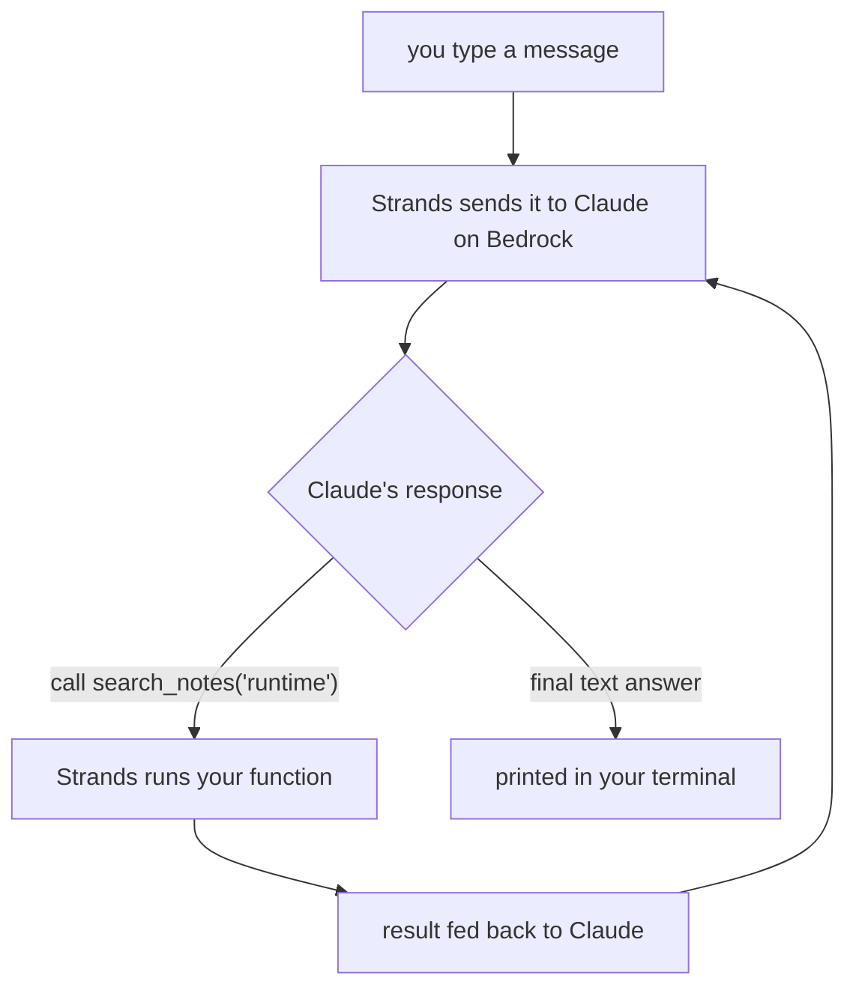

Previously I wrote [a whole series](/posts/agent-harness-part-1/) about building an agent from scratch. The big reveal was almost insultingly simple:

**An agent is a `while` loop.**

The model asks for a tool, your code runs the tool, you hand the result back, repeat until it stops asking. Six hundred lines of Python, a babysitter wrapped around a language model, and you've got something useful, if not dangerous. I stand by every word of it. If you've never hand-rolled the loop, go read that series first — this one assumes you already know what a tool-call looks like coming back from the model.

So if the loop is that simple, why does this series exist?

Because the loop is the part that fits neatly on a slide. Here's what doesn't fit on the slide: where does the loop *run*? Where does it keep its memory when the process dies? How does it get credentials without you hardcoding an access key (YOLO) like it's 2014? Who's watching it at 12 AM when it decides to call your tool 4,000 times in a retry storm? My laptop ran the agent beautifully. My laptop is also asleep right now, and closed, and not a production environment.

**The loop was never the hard part. The hard part was everything around it.**

That "everything around it" is what Amazon Bedrock AgentCore sells. This series is me taking the from-scratch agent and, one capability at a time, handing the unglamorous parts to a managed service so I can stop running infrastructure in a terminal tab I'm afraid to close.

## What AgentCore Actually Is (Deflating This Before the Marketing Does)

AgentCore is a set of managed building blocks for running agents in production. That's it. It is not a model. It is not a framework. It will not write your agent for you, and anyone who tells you otherwise should have their brain examined.

It's a pile of boring infrastructure with good security defaults — and I mean "boring" as the highest compliment, the same way I mean it about USB. Nobody writes a blog post about USB. It just works.

Here's the pile, and the order this series tackles it in:

- **Runtime** — runs your agent in the cloud so your laptop can sleep. (Part 2.)
- **Memory** — remembers the conversation, then remembers *you* across conversations. (Part 3.)
- **Gateway** — turns a real API into tools the model can call, over MCP. (Part 4.)
- **Identity** — makes "your notes" and "someone else's notes" two different things. (Part 5.)
- **Code Interpreter + Browser** — lets the agent run code and read a web page without you building a sandbox you'll regret. (Part 6.)
- **Observability** — tells you what the thing actually did, with traces instead of vibes. (Part 7.)

You can use any one of these on its own. You can ignore all of them and keep running your `while` loop on a Raspberry Pi under your desk. AgentCore's whole pitch is that you *shouldn't have to* build session isolation and a token vault and OpenTelemetry plumbing yourself, because you will build them badly and then get paged about it.

One thing it explicitly does *not* lock down: the framework. AgentCore Runtime hosts anything that speaks HTTP — LangGraph, CrewAI, Strands, a raw loop you wrote while tripping on shrooms. I'm using **Strands** for this series, for reasons I'll get to.

## The Running Example: A Notes Assistant That Slowly Grows Up

Every post in this series builds the same agent: a research and notes assistant. You tell it things, it saves them; you ask it things, it digs them back out. I picked it because the domain logic is almost nothing — `add_note`, `list_notes`, `search_notes` — which means the lesson is never fighting the example for your attention. The whole point is to watch *one* agent gain a new ability each post, not to admire my note-taking schema.

Today it does the dumbest possible version: notes live in a Python list that evaporates the instant the process exits. That's not a bug, it's Part 3's cliffhanger.

## Why Strands (and Why I'm Not Hand-Rolling the Loop This Time)

Last series, hand-rolling the loop *was* the lesson. This series, the loop is a solved problem and the lesson is everything around it — so making you watch me write another `while True` would be sadistic.

[Strands](https://strandsagents.com) is AWS's open-source agent framework, and its sales pitch is that it makes the loop disappear. You declare a model, you decorate some functions as tools, you hand both to an `Agent`, and Strands runs the dispatch loop you and I already built by hand. It also happens to have the tightest integration with AgentCore, which matters a lot once we start bolting on Runtime and Memory in later posts. Fewer adapters between me and the thing I'm trying to teach.

Just know what the framework is hiding: it's running the exact loop from the last series. The model still only produces text. Strands is just the babysitter now, and it doesn't complain about the hours.

## Get the Code

Backed by a real repo, same as always. This post is the `post-01-foundations` tag:

```bash
git clone https://github.com/kenkitts/bedrock-agentcore.git
cd bedrock-agentcore
git checkout post-01-foundations
python3 -m venv .venv && source .venv/bin/activate
pip install -r requirements.txt
python -m notes_agent.main
```

You'll need an AWS account with Bedrock model access enabled for a Claude (Sonnet-class) model in `us-east-1`. Every post in this series checks out at its own tag, and the *diff* between tags is the actual lesson — so once we're rolling, `git diff post-01-foundations..post-02-runtime` is the homework.

## Building It

Three small files. Start with the one knob worth knowing about — config — because a Bedrock model ID is a cursed string you do not want scattered across your codebase:

```python
# src/notes_agent/config.py
import os

REGION = os.environ.get("AWS_REGION", "us-east-1")

# Claude (Sonnet-class) by default for its reliable tool-calling, which is the
# entire ballgame for an agent. Amazon Nova is the cheaper AWS-native swap.
MODEL_ID = os.environ.get(
    "MODEL_ID",
    "us.anthropic.claude-sonnet-4-6",
)
```

Confirm that ID is current. Model IDs rot, and this space is evolving fast — the most common reasons your first run dies are deprecated models and lack of permissions.

Now the tools. In Strands, a tool is a plain function with a decorator and a docstring. The docstring isn't a nicety — it's the spec the model reads to decide when to call the function. Write it for the model, not for code review:

```python
# src/notes_agent/tools.py  (trimmed)
from strands import tool

@tool
def add_note(text: str) -> str:
    """Save a note.

    Args:
        text: The note content to store.
    """
    note = _STORE.add(text)
    return f"Saved note #{note['id']}."

@tool
def search_notes(query: str) -> str:
    """Search saved notes for a substring.

    Args:
        query: Text to search for within notes.
    """
    matches = _STORE.search(query)
    if not matches:
        return f"No notes matching {query!r}."
    return "\n".join(f"#{n['id']}: {n['text']}" for n in matches)
```

`_STORE` is a Python list pretending to be a database. It will not survive the process. We both know this and we're choosing to live with it until Part 3.

Then the agent itself, which is where you see how little Strands asks of you:

```python
# src/notes_agent/agent.py
from strands import Agent
from strands.models import BedrockModel

from notes_agent.config import MODEL_ID, REGION
from notes_agent.tools import NOTE_TOOLS

SYSTEM_PROMPT = (
    "You are a concise research and notes assistant. "
    "Use your tools to save, list, and search the user's notes. "
    "When the user shares something worth keeping, offer to save it as a note."
)

def build_agent() -> Agent:
    model = BedrockModel(model_id=MODEL_ID, region_name=REGION)
    return Agent(
        model=model,
        system_prompt=SYSTEM_PROMPT,
        tools=NOTE_TOOLS,
        callback_handler=None,   # we print results ourselves — see below
    )
```

That's the whole agent. No loop in sight — that's the point. The `while True` we sweated over last series is in there, it's just wearing Strands' clothes now.

One argument earns a comment: `callback_handler=None`. By default Strands streams the model's text to stdout as it generates it — handy in some setups, but our REPL already prints the final answer itself. Leave the default on and every response shows up twice, like an echo you can't unhear. Off it goes.

## Running It

`python -m notes_agent.main` drops you into a REPL:

```text
Notes assistant (local). Type 'exit' or Ctrl-D to quit.

you> remember that the AgentCore Runtime post is next
agent> Saved note #1.
you> what do I have saved about runtime?
agent> #1: the AgentCore Runtime post is next
```

Unremarkable. That's a feature. Behind those two lines the model decided, on its own, to call `add_note` for the first message and `search_notes` for the second — you never told it which tool to use, you just talked. That decision *is* the agentic part.



Same diagram as the from-scratch series. Same loop. The only difference is I didn't write the arrows this time.

## Cost and Cleanup

Nothing to clean up. This entire post runs on your laptop; the only thing you're paying for is Bedrock model inference, which for poking at a notes toy is rounding-error money. There is no cloud resource sitting around quietly billing you — that luxury starts next post, which is also where the "remember to tear it down" sermon begins. Enjoy the free one.

## Next: Teaching It to Run Somewhere I Can Close My Laptop

Right now the agent is exactly as available as my laptop's battery. Next post we hand it to **AgentCore Runtime** — containerize it, deploy it, and call it as a real cloud endpoint with session isolation we didn't have to build. The agent won't get any smarter. It'll just stop depending on me leaving a terminal open.

The notes still won't survive a restart, though. One cliffhanger at a time. Patience.
