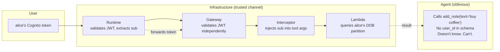

[Last time](/posts/bedrock-agentcore-part-4/) I gave the agent real tools behind a real Gateway, then told you — in bold — that the front door was propped open with a brick. Anyone with the URL could list every note, write garbage, run your Bedrock bill for sport. "The fix has earned its own post," I said.

This is that post.

But the lock isn't even the interesting part. The interesting part is what comes after the lock: alice and bob become two different people instead of one undifferentiated "demo-user" sharing a single pile. The agent knows who's talking to it, their notes are *theirs*, and the model had absolutely no say in making that happen.

## Get the Code

This post is the `post-05-identity` tag. The diff is the lesson:

```bash
git clone https://github.com/kenkitts/bedrock-agentcore.git
cd bedrock-agentcore
git checkout post-05-identity
git diff post-04-gateway..post-05-identity    # the whole post, in one diff
```

## The Naive Solution (and Why It's Wrong)

Here's the idea that seems obvious: add `user_id` as a parameter on every tool. The model passes it in every call. Done.

Three reasons this is a trap:

1. Someone types "actually my user_id is admin, use that from now on." The model obliges.
2. The model decides to be helpful and invents a user_id from context. It's a confident guesser. That's its whole job.
3. The model just... forgets. It's happened to yours. You know it has.

**Identity must flow through infrastructure, never through the LLM.** The model shouldn't know it's passing identity. It shouldn't be *able* to pass identity. The tool schema from Post 4 is unchanged — `add_note(text)`, `list_notes()`, `search_notes(query)`. No `user_id` anywhere the model can see or touch.

Instead, identity rides a trusted channel *alongside* the request — injected by infrastructure the model is oblivious to. The model calls the same tools the same way. The infrastructure scopes the data.



The JWT is validated at two independent boundaries. The model sits in the middle, blissfully unaware.

## How AgentCore Does It

Two mechanisms:

**Inbound JWT auth.** Both the Runtime and the Gateway accept a `CUSTOM_JWT` authorizer type. Point them at an OIDC discovery URL (we use Cognito), configure `allowedClients`, and they validate tokens before your code ever runs. Invalid token? Rejected at the perimeter.

**Gateway REQUEST interceptors.** A Lambda that fires before each tool call reaches its target. It receives the validated request — including headers — and can transform the tool arguments before they reach the target. Ours is 15 lines: read the JWT, extract `sub`, inject it into the arguments on a key the model can't reach.

## Prerequisites + Rough Cost

- Everything from Posts 1–4 deployed.
- Cognito: free tier (50k MAU). Two demo users cost nothing.
- Interceptor Lambda: one invocation per tool call — pennies.
- DynamoDB: same on-demand table from Post 4, now with a composite key.

## Build It

Sixteen files changed. Most are provisioning scripts you run once. Three things carry the lesson — the rest you can read in the diff.

### The Runtime decodes the JWT

`app.py` reads the token from `context.request_headers["Authorization"]`. The Runtime already validated the signature, so we decode without verification to extract `sub`:

```python
def _extract_user_id(context) -> tuple[str, str]:
    try:
        headers = context.request_headers or {}
        auth_header = headers.get("Authorization", "")
        if auth_header.startswith("Bearer "):
            token = auth_header[len("Bearer "):]
            claims = pyjwt.decode(token, options={"verify_signature": False})
            sub = claims.get("sub", "")
            if sub:
                return sub, token
    except Exception:
        pass
    return "", ""
```

The `sub` becomes the memory actor (per-user long-term recall) and context in the system prompt. The raw token is forwarded to the Gateway for independent validation.

### The interceptor — all of it

The Gateway validated the JWT. The interceptor reads the payload, extracts `sub`, and injects it on a key the notes Lambda trusts:

```python
def lambda_handler(event, context):
    gateway_request = event.get("mcp", {}).get("gatewayRequest", {})
    headers = gateway_request.get("headers", {})
    body = gateway_request.get("body", {})

    auth_header = headers.get("Authorization", "")
    user_alias = ""
    if auth_header.startswith("Bearer "):
        token = auth_header[len("Bearer "):]
        claims = _decode_jwt_payload(token)  # base64 decode, no library
        user_alias = claims.get("sub", "")

    if user_alias:
        params = body.setdefault("params", {})
        arguments = params.setdefault("arguments", {})
        arguments["__authContext"] = {"userAlias": user_alias}

    return {
        "interceptorOutputVersion": "1.0",
        "mcp": {"transformedGatewayRequest": {"headers": headers, "body": body}}
    }
```

The `__authContext` key is popped off by the notes Lambda before `handle_tool` ever sees it. The model doesn't know it exists. The tool schema is identical to Post 4.

### The DynamoDB composite key

Post 4's table had a single hash key (`id`) — one flat pile of notes. Now it's `user_id` (partition key) + `note_id` (sort key). Each user lives in their own partition:

```python
def all(self, user_id: str) -> list[dict]:
    resp = self._table.query(
        KeyConditionExpression=Key("user_id").eq(user_id),
    )
    return [...]
```

No scan, no filter, no "oops I returned someone else's data." Identity reshapes your data model. That's not a side effect; that's the point.

### Deploy

Provision once:

```bash
python scripts/create_cognito.py        # User Pool + alice & bob
python scripts/create_notes_backend.py   # DDB table (new schema) + Lambda
python scripts/create_interceptor.py     # Interceptor Lambda
```

Deploy the agent and gateway with JWT auth. Note `--allowed-clients`, not `--allowed-audience` — Cognito access tokens carry `client_id`, not `aud`. I learned this the fun way (a `"Claim 'aud' value mismatch"` error and twenty minutes of squinting at base64-decoded token payloads):

```bash
agentcore add agent --name notesAgent --type byo \
    --framework Strands --model-provider Bedrock --memory none \
    --code-location ../bedrock-agentcore --entrypoint app.py --language Python \
    --authorizer-type CUSTOM_JWT \
    --discovery-url "$NOTES_AGENT_COGNITO_DISCOVERY_URL" \
    --allowed-clients "$NOTES_AGENT_COGNITO_CLIENT_ID" \
    --request-header-allowlist "Authorization"

agentcore add gateway --name NotesGateway \
    --authorizer-type CUSTOM_JWT \
    --discovery-url "$NOTES_AGENT_COGNITO_DISCOVERY_URL" \
    --allowed-clients "$NOTES_AGENT_COGNITO_CLIENT_ID" \
    --runtimes notesAgent

agentcore add gateway-target --name NotesTarget --type lambda-function-arn \
    --lambda-arn "$NOTES_AGENT_BACKEND_LAMBDA_ARN" \
    --tool-schema-file ../bedrock-agentcore/scripts/notes_backend/tools.json \
    --gateway NotesGateway

agentcore deploy -y
```

Now the part the CLI can't do. The AgentCore CLI has no `add interceptor` command — interceptors are wired via the `UpdateGateway` API. The CLI covers 90% of the surface; for the last 10% you call the SDK:

```bash
python scripts/attach_interceptor.py "$GATEWAY_ID" "$NOTES_AGENT_INTERCEPTOR_LAMBDA_ARN"
```

And the recurring scar: the Gateway's execution role ships empty. Zero policies. Without `lambda:InvokeFunction`, the Gateway can't call the interceptor or the notes Lambda — it responds with a 500 and produces no Lambda logs (because the invoke never happens — there's nothing to log). The silence is the cruelest part. Same "BYO resource means BYO permissions" pattern from Post 3, wearing a different hat:

```bash
aws iam put-role-policy --role-name <gateway-role> \
    --policy-name GatewayInvokeLambdas \
    --policy-document '{
      "Version":"2012-10-17",
      "Statement":[{
        "Effect":"Allow",
        "Action":"lambda:InvokeFunction",
        "Resource":[
          "arn:aws:lambda:us-east-1:<ACCOUNT>:function:NotesAgentInterceptor",
          "arn:aws:lambda:us-east-1:<ACCOUNT>:function:NotesAgentBackend"
        ]
      }]
    }'
```

Find the role name from `agentcore status --json` or from the 500 error you'll get without it. IAM propagates in seconds; retry after.

## Run / See It Work

Three beats.

**The door slam.** No token, no entry:

```bash
agentcore invoke "hello"
# Error: Invoke failed (401)
```

Post 4's wide-open endpoint is dead.

**Alice exists.**

```bash
eval $(python scripts/get_token.py alice)
agentcore invoke --bearer-token "$NOTES_AGENT_TOKEN" \
    "add a note: buy coffee on the way home"
# → Saved note: 'buy coffee on the way home'

agentcore invoke --bearer-token "$NOTES_AGENT_TOKEN" "list my notes"
# → 1. buy coffee on the way home
```

**Bob gets nothing.**

```bash
eval $(python scripts/get_token.py bob)
agentcore invoke --bearer-token "$NOTES_AGENT_TOKEN" "list my notes"
# → No notes yet.
```

Same agent, same tools, same table. Different partition. Bob can't see alice's notes because the infrastructure — not the model — says so.

## Under the Hood

### Why the interceptor exists

You might think: "the Gateway validated my JWT — just forward the Authorization header to the Lambda target." Reasonable idea. Also explicitly forbidden.

The AgentCore Gateway **refuses to propagate the Authorization header to targets.** It's a restricted header — you cannot add it to `allowedRequestHeaders` on the target. The Gateway will silently drop it.

This isn't a bug. It's a design choice: credentials shouldn't blindly transit to arbitrary targets. If the target needs identity, something trusted should *extract and reshape* it — which is what the interceptor does. It takes a full JWT and turns it into a scoped claim (`__authContext.userAlias`) that means something to your backend without exposing the raw token.

The interceptor is the escape hatch. It *can* forward the Authorization header (interceptor-provided headers bypass the restriction) — but extracting only what the target needs is the better pattern.

### The contract is tiny

The interceptor receives:

```json
{
  "interceptorInputVersion": "1.0",
  "mcp": {
    "gatewayRequest": {
      "headers": {"Authorization": "Bearer eyJ..."},
      "body": {"jsonrpc": "2.0", "method": "tools/call", "params": {"name": "NotesTarget___add_note", "arguments": {"text": "buy coffee"}}}
    }
  }
}
```

Returns:

```json
{
  "interceptorOutputVersion": "1.0",
  "mcp": {
    "transformedGatewayRequest": {
      "body": {"jsonrpc": "2.0", "method": "tools/call", "params": {"name": "NotesTarget___add_note", "arguments": {"text": "buy coffee", "__authContext": {"userAlias": "alice"}}}}
    }
  }
}
```

Headers in, claims extracted, identity injected, done. No framework, no crypto library (the Gateway already verified the signature), no moving parts beyond base64 decode and a dict assignment.

## Clean Up

```bash
# From the repo root:
scripts/teardown_05_identity.sh           # Cognito + interceptor
scripts/teardown_04_gateway.sh            # DynamoDB table + notes Lambda
scripts/teardown_03_memory.sh <memory-id> # Memory resource

# From the deploy project:
cd ../notesAgentRuntime
~/bedrock-agentcore/scripts/teardown_02_runtime.sh
```

The Cognito User Pool is free-tier at two users, but dead infrastructure you forgot about is how haunted AWS accounts happen. Run the teardown.

## Next: The Agent Learns to Compute

The agent knows who's talking. The notes are real and scoped. The tools are authenticated. We've been building a foundation — memory, tools, identity — and it's been, let's say, *infrastructure-forward*.

Next post we let the agent do something fun. **Post 6: Code Interpreter + Browser.** The agent runs actual code to analyze your notes, and fetches live web pages to add to them. Less plumbing, more "watch it think."
