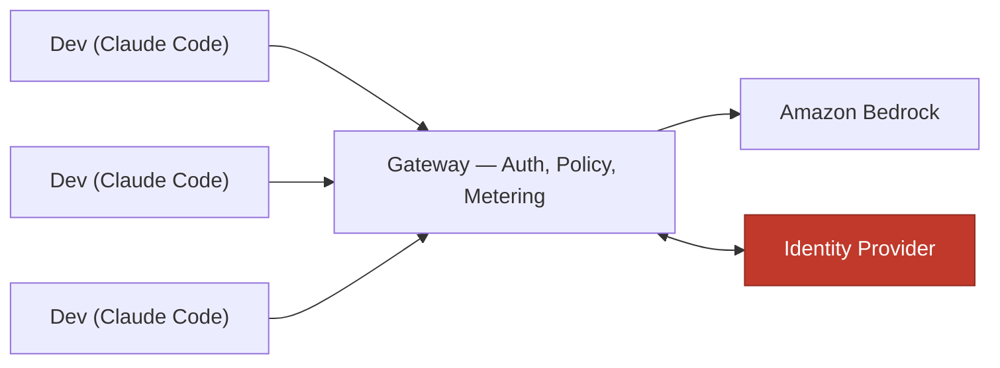

Your developers are already using Claude Code. Right now. On personal Anthropic accounts or individual API keys, expensed on a T&E line that says "software tools," with your source code as the payload. You can't see the spend, can't say who's spending it, can't cap it, and if you asked your CISO whether any of this is compliant with your data-handling policy, she would say something unprintable.

That is the status quo an LLM gateway is reacting to. Not a hypothetical future where AI tools proliferate — the present, where they already have.

## What a Gateway Actually Is

Think about your corporate web proxy. Every outbound HTTP request from inside your network routes through it. It checks who you are, whether you're allowed to go where you're going, logs the trip, and enforces policy — all without any individual user needing to manage that process themselves. It's invisible when things are working and the first thing people point at when they aren't.

An LLM gateway is the same concept, applied to inference traffic.

It sits between your developers' AI tools and the model provider — in this case, between [Claude Code](https://claude.com/product/claude-code) and Amazon Bedrock. Instead of each developer holding a credential and talking directly to the provider, they authenticate to the gateway with their corporate IdP. The gateway holds the upstream credential, verifies identity on every request, enforces policy, tracks usage, and routes inference.

Anthropic [introduced the Claude apps gateway](https://claude.com/blog/introducing-the-claude-apps-gateway) in June 2026, built and shipped inside the same `claude` binary your developers already install. The whole thing runs as a single stateless container backed by a PostgreSQL database — one YAML config file, no magic.



The developers see an SSO login. The model provider sees one credential — yours. Everything in between is yours to observe and control.

## The Four Problems It Solves

### 1. Credential sprawl

Before a gateway: you might have twenty developers, twenty API keys (or twenty personal accounts), and no reliable way to audit what was called, when, or with what context. Offboarding someone means hoping you remember to revoke their key. Hopes and prayers are not access control policy.

After: no developer holds a provider credential. They authenticate with their corporate identity. Onboarding is an IdP group membership. Offboarding is removing them from that group. The access model is the same as everything else in your environment.

### 2. A spend bill you can actually read

The gateway tracks usage per user, per group, and per model. That answer to "how much are we spending on AI coding tools, and who's spending it" stops being "we think about $X, maybe 🤷‍♂️?" and becomes a real dashboard with real numbers.

And crucially, you can enforce caps. Per-user, per-group, or org-wide daily, weekly, or monthly limits. When a developer hits their cap, the gateway returns a `429` and they get a message you configured:

```
HTTP 429 Too Many Requests
"Spend limit reached. Contact your admin to increase your cap."
```

That's it. No surprise charges. No end-of-month invoice archaeology. The conversation between finance and engineering about AI tool budgets goes from "I have no f'ing idea" to "here's the breakdown by team."

### 3. Visibility into something you didn't know you needed to see

Here's the one that surprised me: the Claude gateway breaks down token usage by *query source* — specifically, whether the request came from a human typing into Claude Code, or from an autonomous subagent running as part of a larger task.

When your developers start using Claude Code's agentic features — spinning up sub-agents to research, write, test, and refactor in parallel — a single session can involve dozens of model calls that never touched a human keyboard. That's fine. It's also the reason a developer who spent $12 last Tuesday spent $140 this Tuesday, and without this dimension you'd never know why.

The question "how much of our AI spend is humans, versus agents calling agents?" is going to matter to your finance team very soon if it doesn't already.

### 4. Inference through your cloud, not theirs

The gateway routes inference through a provider you already have a relationship with — in this case, Bedrock — rather than through Anthropic's API directly. Anthropic cites data residency as the [primary reason organizations deploy it](https://code.claude.com/docs/en/claude-apps-gateway): your code, your context, your prompts stay in your cloud account and never leave for a third-party API endpoint.

If you have data-handling requirements, a CISO, or any regulatory exposure in financial services, healthcare, or government, this is likely the sentence your legal team has been waiting for.

## What It Costs You

The pitch above is clean. Here's the dirt.

**You built a choke point.** Everything routes through the gateway now. If it's down, nobody ships. That's a new thing that carries a pager, requires an availability target, and needs runbooks. The gateway itself is stateless — restarting a container is fast — but the database, the identity integration, and the private network path all have their own failure modes.

**Standing infrastructure, to save on tokens.** To gain this level of control, you now run compute, a database, and a load balancer twenty-four hours a day, seven days a week. The economics make sense when dozens of developers are spending meaningful money. They look different for a five-person team with a $500/month AI budget. The crossover point is the entire decision, and only you know where you are relative to it.

**You almost certainly already have the network piece.** Most organizations with remote workers have a VPN or private connectivity solution. The gateway runs on a private endpoint — no public internet exposure. If you already have a way to get developers' traffic into your AWS VPC, you have what you need. If you don't, that's infrastructure work you'd be doing regardless of the gateway.

**A new security surface.** Centralizing control also centralizes blast radius. You're now running an auth server, a session store full of short-lived tokens, and admin API keys with spend-limit write access. The gateway didn't create these risks — the ungoverned API-key-per-developer model had them too, just distributed and invisible. But the gateway means someone has to own this surface properly.

## So Do You Actually Need One?

Probably not if you have a handful of developers, no regulatory pressure, and a finance team that is happy with a shared budget line and a gut-check. The governance overhead isn't worth it at small scale.

Probably yes if you have dozens or more developers using AI coding tools, data-handling requirements that apply to source code and context, or a finance or compliance team that is starting to ask pointed questions about AI spend that you can't currently answer. The gateway is governance infrastructure — you buy it when the cost of *not* having governance exceeds the cost of running it.

The honest framing: the gateway doesn't make AI tools safer or cheaper. It makes them *legible*. You can see what's happening, attribute it, cap it, and prove to your security team that inference isn't leaving your cloud account. That's worth something, and the amount it's worth is exactly what you should be benchmarking against the operational cost of running it.

## What's Next

The deployment is where it gets interesting.

In the next post, we get into the actual build — five CDK stacks, a gateway that refused to talk to its own telemetry collector, an architecture mismatch that didn't surface until runtime, and a few other scars from putting this in front of real traffic. If that sounds like your kind of Friday afternoon, [the code is here](https://github.com/kenkitts/claude-apps-gateway-cdk) and the next post is coming.

---

*This is Part 1 of a series on the Claude apps gateway deployed on Amazon Bedrock. I deployed one. Part 2 is about what that actually looked like. Everything here is my own opinion — my employer has better ones.*
