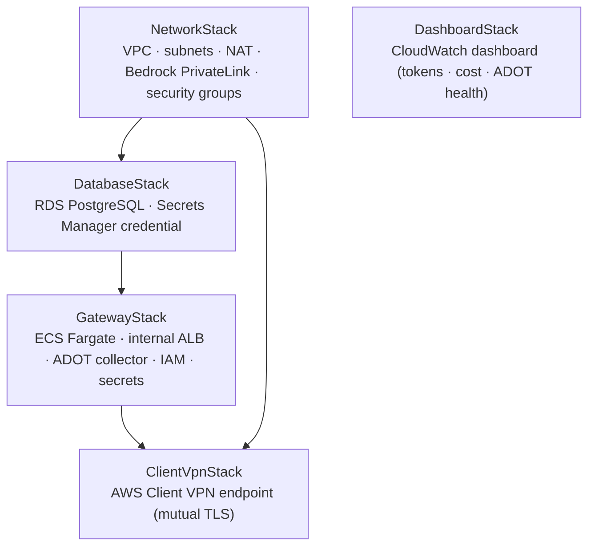
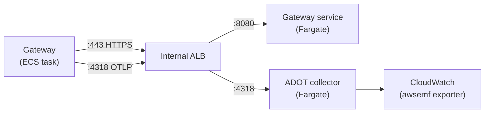

[Part 1](/posts/llm-gateway-part-1/) was for the person who signs the invoice. This one is for the person who gets handed the Jira ticket afterward.

If you read that post and thought "yes, fine, I want this, how hard can it be" — this post is the honest answer to that question. It's a deployment walkthrough with the bad parts left in.

The code is at [github.com/kenkitts/claude-apps-gateway-cdk](https://github.com/kenkitts/claude-apps-gateway-cdk). Five Python CDK stacks, a Docker image that fetches and verifies the `claude` binary at build time, and enough inline comments to reconstruct most of the decisions made under pressure. Clone it now if you want to follow along; the scars will make more sense with the code open.

## Get the Code

```bash
git clone https://github.com/kenkitts/claude-apps-gateway-cdk.git
cd claude-apps-gateway-cdk
pip install -r requirements.txt
```

The rest of this post is about what you're looking at when you open that repo, and — more usefully — why several parts of it are shaped the way they are instead of the obvious way.

## Five Stacks, One Job

The gateway is five CDK stacks deployed in order. Here's the minimal map:



`DashboardStack` has no CDK dependency on anything — it references the ECS cluster by name string and can be deployed, iterated on, or torn down without touching infrastructure. The rest form a chain: you need the VPC before you can place the database, and you need the database before the gateway task can connect to it.

The deploy order, written out:

```bash
cdk deploy ClaudeGatewayNetworkStack
cdk deploy ClaudeGatewayDatabaseStack
cdk deploy ClaudeGatewayStack
cdk deploy ClaudeGatewayClientVpnStack
cdk deploy ClaudeGatewayDashboardStack   # any time
```

Or `cdk deploy --all` once you've filled in the `YOUR_*` placeholders in `app.py` and `gateway_image/gateway.yaml`. The placeholders are not decoration — `cdk synth` will technically pass with fake ARNs, but CloudFormation will fail later in ways that are annoying to trace.

The mermaid above is the stack dependency chain. Here's what those five stacks actually add up to at runtime — every box is something one of them stood up:

![Runtime architecture of the Claude apps gateway on AWS: a developer laptop connects over mutual TLS through an AWS Client VPN endpoint to an internal ALB inside a VPC. The ALB fronts two ECS Fargate services — the Claude gateway (port 8080) and an ADOT collector (port 4318). The gateway calls Amazon Bedrock through a PrivateLink VPC endpoint, connects to RDS PostgreSQL 17.7 in private isolated subnets, and reaches Secrets Manager, ACM, and Okta OIDC through a NAT gateway. The ADOT collector ships metrics to CloudWatch via the awsemf exporter.](gateway_architecture.webp)

If a few of the shapes look non-obvious — why the telemetry collector is its own Fargate service, why the ALB carries two listeners, why the PostgreSQL version is so specific — good. That's the rest of this post.

Now for the parts that didn't go according to plan.

## Scar 1: The Gateway Refused to Talk to Its Own Telemetry Collector

The gateway's `telemetry` config takes a `forward_to` URL — where to ship OTLP metrics. The obvious first draft pointed it at `http://localhost:4318`, a sidecar container running in the same Fargate task.

```yaml
# First draft of gateway.yaml — this does not work
telemetry:
  forward_to:
    - url: http://localhost:4318
      metrics: true
```

Deployed fine. First inference request came in. Telemetry was dead. The ECS logs had this:

```
ECONNREFUSED_SSRF: connection refused (blocked: cloud metadata / link-local)
```

The gateway ships with an SSRF guard — a security control that blocks outbound requests to loopback addresses, link-local ranges, and cloud metadata endpoints. This is a reasonable thing for a gateway sitting in your VPC to refuse to do, since it means a compromised upstream can't bounce a request off `localhost` and reach something it shouldn't. It is, however, deeply inconvenient when the thing you're trying to reach on `localhost` is your own telemetry collector.

The fix: the ADOT collector is not a sidecar. It's its own Fargate service, reached via a second HTTPS listener on the same internal ALB. The gateway's `forward_to` URL is the ALB's DNS name on port 4318 — a real routable address the SSRF guard doesn't block.



This costs you a second ECS service and a second target group on the ALB, but it reuses the same ACM certificate and the same load balancer. The ADOT collector becomes infrastructure you monitor separately — the dashboard has a health widget specifically for this, because a flat ADOT graph while the token graphs are also flat means "no usage," but a flat ADOT graph while token graphs are active means the collector is down and you're flying blind. Those are different problems.

The `gateway.yaml` entry that actually works:

```yaml
telemetry:
  forward_to:
    - url: https://claude-gateway.YOUR_DOMAIN:4318
      metrics: true
      logs: false
      traces: false
```

One note on the ADOT setup: the awsemf exporter writes metrics to CloudWatch Logs as Embedded Metric Format documents — not by calling `cloudwatch:PutMetricData` directly. This matters for the IAM policy on the ADOT task role. If you give it `cloudwatch:PutMetricData`, it will have a permission it doesn't use. What it actually needs is `logs:PutLogEvents` scoped to the metrics log group. CloudWatch converts the EMF documents into proper metrics automatically. The repo has this right; I'm flagging it because the docs for awsemf gloss over it and I wasted time on it.

## Scar 2: The Binary That Wouldn't Run

The gateway image builds in two stages: a `fetch` stage that pulls the `claude` binary from Anthropic's release bucket and verifies it against a GPG-signed manifest, then a runtime stage that copies the verified binary in. This is the right approach — no pre-downloaded artifacts committed to source control, no `curl | bash` without a signature check.

The first deployed container exited immediately with:

```
exec /usr/local/bin/claude: exec format error
```

`exec format error` on Linux means the binary's architecture doesn't match the host. The Fargate task was X86_64. The binary in the image was ARM64. The build host was an Apple Silicon Mac running Finch, which builds ARM64 images natively by default.

The fix is one line in the CDK asset:

```python
gateway_image_asset = ecr_assets.DockerImageAsset(
    self,
    "GatewayImage",
    directory="gateway_image",
    platform=Platform.LINUX_AMD64,   # explicit, not inherited from build host
)
```

And the corresponding build arg in the Dockerfile:

```dockerfile
ARG CLAUDE_CODE_PLATFORM=linux-x64
```

The thing that made this annoying to diagnose: the image built successfully, pushed successfully, and the task definition referenced it correctly. Everything looked fine until the container actually started. CloudWatch had the `exec format error` but nothing in the CloudFormation events pointed there — you had to know to look at the ECS task stopped reason and then dig into the container logs.

If you're deploying from Apple Silicon and your container exits immediately with no obvious error, check the architecture before anything else.

## Scar 3: The RDS Version That Didn't Exist

This one is quieter but took longer to find.

The CDK construct for RDS PostgreSQL takes a version constant: `rds.PostgresEngineVersion.VER_16_4`, or `VER_17_1`, or similar. These constants are generated from the CDK library at release time. The problem is that `aws-cdk-lib`'s version constants and RDS's live deprecation schedule don't move in lockstep. A constant that existed in the CDK library version you pinned may refer to a PostgreSQL minor version that RDS has since deprecated and removed.

The first attempt used `VER_16_4`. CloudFormation error:

```
Cannot find version 16.4 for postgres
```

Switched to `VER_17_1`. Same error. At this point it's worth going to the source instead of guessing:

```bash
aws rds describe-db-engine-versions \
  --engine postgres \
  --region us-east-1 \
  --query 'DBEngineVersions[].EngineVersion'
```

That returns the actual live list for your account and region. Cross-reference with the CDK constants in `aws_rds.PostgresEngineVersion` and pick one that exists in both. The repo landed on `VER_17_7` — mature, not bleeding-edge, confirmed present in both the live RDS list and the CDK library after bumping `aws-cdk-lib` to `2.260.0`.

The broader lesson: when a CDK constant fails a live deploy with "version not found," the fix is a `describe-db-engine-versions` call, not a CDK upgrade. The upgrade just gives you more constants to try.

## Scar 4: The Model That Wasn't in the Catalog

This one appeared after the deploy was healthy, which made it more confusing.

The gateway was up, OAuth worked, Claude Code could sign in. Then requests for `claude-sonnet-5` came back with "not in the operator's model allowlist" — despite `auto_include_builtin_models: true` in the config and no restrictive `managed.policies` block.

The config looked right. The IAM policy allowed `bedrock:InvokeModel` on the correct ARN patterns. `aws bedrock list-foundation-models` confirmed the model existed in the account.

The version running was `2.1.195`. Claude Sonnet 5's Bedrock release date was 2026-06-30. The binary predated the model's availability, which meant its built-in model catalog had no entry for it. `auto_include_builtin_models: true` only includes models that are in the binary's catalog — it doesn't do a live lookup.

Fix: bump the pinned version in the Dockerfile and redeploy. The gateway version is now resolved dynamically at build time (see the `Dockerfile` — it fetches `downloads.claude.ai/claude-code-releases/latest` and verifies the manifest before downloading the binary), so this class of problem goes away on the next `cdk deploy` that rebuilds the image.

The diagnostic path that found it: `curl https://claude-gateway.YOUR_DOMAIN/healthz` returns the running gateway version. If the gateway is rejecting a model that exists in Bedrock, check the gateway version before reading the IAM policy for the fourth time.

## The Dependency Cycle CDK Wouldn't Synth

One more, because it's the kind of thing that makes you feel personally targeted by a build tool.

`ClientVpnStack` needs to grant its VPN client security group ingress on the ALB security group (port 443). The natural CDK call is `alb_security_group.add_ingress_rule(peer=vpn_client_sg, ...)`. The problem is that `alb_security_group` lives in `NetworkStack`, and modifying it from `ClientVpnStack` creates an implicit CDK ownership relationship — CDK infers that `ClientVpnStack`'s security group must exist before `NetworkStack` can complete its rule. Combined with `ClientVpnStack`'s explicit `add_dependency(network_stack)`, that's a cycle:

```
ClientVpnStack depends on NetworkStack (explicit)
NetworkStack depends on ClientVpnStack (implicit, via the ingress rule mutation)
```

CDK refuses to synth: `DependencyCycle`.

The fix is `CfnSecurityGroupIngress` — the L1 resource, not the L2 helper method. It references both security groups by ID value and doesn't create any CDK ownership relationship. CloudFormation just needs both groups to exist when the resource is created, and the explicit `add_dependency(network_stack)` already guarantees that.

```python
# ClientVpnStack.__init__
ec2.CfnSecurityGroupIngress(
    self,
    "AlbIngressFromVpnClients",
    group_id=alb_security_group.security_group_id,
    source_security_group_id=self.vpn_client_security_group.security_group_id,
    ip_protocol="tcp",
    from_port=443,
    to_port=443,
    description="HTTPS from Client VPN-connected developers",
)
```

The rule is in `ClientVpnStack`, the group it mutates is in `NetworkStack`, and CDK has nothing to say about it. Sometimes the L1 escape hatch is the correct answer, not the last resort.

## What Actually Works

After all of that: the gateway is up, developers connect via Client VPN, OAuth goes through Okta, inference routes to Bedrock through the VPC PrivateLink endpoint, and the CloudWatch dashboard has real numbers in it.

The ADOT collector is the thing most likely to silently fail without being obvious — keep the health widget in view and make sure the metrics log group (`/claude-gateway/metrics`) is accumulating new entries after developer activity. If it isn't, the collector is the first place to look, not the gateway.

The Client VPN setup is the only genuinely manual piece: easy-rsa, certificate generation, ACM import. It's documented in the README with the exact commands. It's a one-time thing, not something CDK can model declaratively, and there's no shortcut — mutual TLS requires a CA you control and the gateway should never be publicly reachable anyway.

Everything else deploys with `cdk deploy --all` once you've filled in the placeholders.

---

*This is Part 2 of a series on the Claude apps gateway deployed on Amazon Bedrock. [Part 1](/posts/llm-gateway-part-1/) is for the person who decides whether to build this. This one is for the person who has to. The code is at [github.com/kenkitts/claude-apps-gateway-cdk](https://github.com/kenkitts/claude-apps-gateway-cdk). My employer still has better opinions than I do.*
